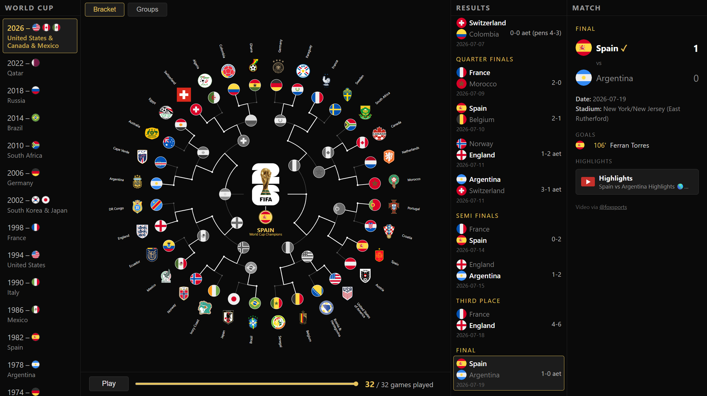
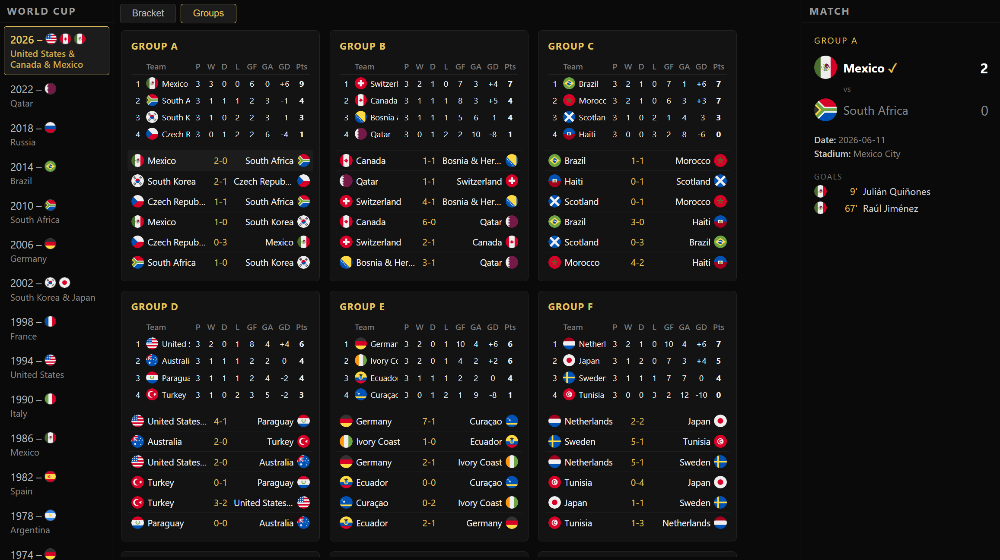

# FIFA World Cup — Circular Knockout Bracket

A radial visualisation of a FIFA World Cup knockout stage, for **any edition
from 1930 to 2026**. The bracket's entry-round teams sit on the outer ring;
winners advance **inward** along a white path toward the champion at the
centre. Results are pulled from a static historical snapshot 
of [openfootball/worldcup.json](https://github.com/openfootball/worldcup.json).

**▶ [Interactive version](https://v7t.github.io/fifa-world-cup-brackets/)** —
pick any edition from 1930 to 2026 on the left, then drag the slider to
replay that tournament game by game.

## What's here

| File | Purpose |
| --- | --- |
| `build_web.py` | Builds the interactive page (all 23 editions) into `docs/index.html` |
| `bracket_data.py` | Loads match data and derives knockout-bracket structure from it |
| `asset_paths.py` | Crest/logo filename conventions and SVG aspect-ratio inspection |
| `historical_teams.py` | Every historical team name -> flag code / fallback-badge acronym |
| `worldcup_data/` | Static snapshots of every World Cup edition, 1930-2026 |
| `country_flags/`, `country_crests/` | Vector flags and federation crests |
| `tournament_logos/` | FIFA World Cup tournament-logo SVGs, one per edition (1930-2026) |

Bracket size varies by edition: 1930 and 1982 start at the Semi-finals (4
teams), 1954-1970/1986-1994 vary between 8 and 16, 1998-2022 start at the
Round of 16, and 2026 starts at the Round of 32. A few irregular early
tournaments only had a small knockout portion at all (1950's champion was
decided by a round-robin group, so its "bracket" is just that group's
decisive match) -- see the docstring in `bracket_data.py` for how each
edition's entry round is derived. Every edition shows its own real tournament
logo at centre (falling back to a plain year badge only if that edition's SVG
isn't on disk yet -- see `tournament_logos/`).

## Usage

```bash
python build_web.py                      # interactive page (all editions) -> docs/index.html
```

## The interactive page

`build_web.py` produces a single self-contained HTML file (no server, no CDN):

- **World Cup column (left)** — every edition from 1930 to 2026; selecting one
  swaps the bracket, results list and match details to that tournament.
- **Slider** — scrub from 0 games played to the last decided match; the bracket
  is re-derived for each position, so a team stays in colour until the game that
  actually knocks it out.
- **Results list** — grouped by round, with scores (incl. `aet` / penalties).
  Click any match to jump the slider to it.
- **Match details (right)** — score, venue, goal scorers, and (2026 only)
  highlight video links for the selected match.
- **Play** — animates the whole tournament.

Flags, crests and tournament logos are embedded once (shared across all 23
editions) as SVG data-URIs and referenced via `<use>`, so scrubbing and
switching years is instant and everything stays resolution-independent. Only
2026 has highlight video links, since FOX Sports' YouTube catalog (the source
for those) only covers that edition.

### Bracket tab



The knockout stage as a radial tree: entry-round teams sit on the outer ring,
winners advance inward round by round, and the champion, its flag and its
name sit at the centre. The right-hand columns list every completed result
and the currently-selected match's detail.

### Groups tab



The circular bracket has no room for a round-robin group stage, so a separate
**Groups** tab shows every group's standings table (P/W/D/L/GF/GA/GD/Pts)
and match results with scorers -- including the second-round group stage
1974/1978/1982 used instead of a quarter-final bracket, and 1950's
round-robin championship group. Hidden for the two editions with no group
stage at all (1934, 1938 -- pure knockout).

## Rendering notes

- Every flag, crest and tournament logo is embedded as vector SVG (a data-URI),
  never rasterised -- the browser renders it directly, so the page stays
  resolution-independent and scrubbing the slider is instant.
- `build_web.py` still uses matplotlib, but only offline, to compute the same
  flag/crest/logo sizing math a matplotlib figure would use, so the page's
  proportions match the project's original rendering.

## Requirements

Python 3.14+ — see `pyproject.toml`.

```bash
uv sync
```

## Credits

None of the data or artwork here is mine — this project only draws it:

| Source | Used for |
| --- | --- |
| [openfootball/worldcup.json](https://github.com/openfootball/worldcup.json) | Fixtures, scores and results (`worldcup_data/`) |
| [circle-flags](https://github.com/HatScripts/circle-flags) by HatScripts | Country flags (`country_flags/`) |
| [football-logos.cc](https://football-logos.cc/national-teams/) | Federation crests (`country_crests/`) |
| [football-logos.cc/tournaments](https://football-logos.cc/tournaments/) | FIFA World Cup tournament-logo SVGs (`tournament_logos/`) |

Every FIFA World Cup tournament logo and federation crest embedded here is
the trademark and property of FIFA and the respective national associations.
They are used here for illustration in a non-commercial, unofficial fan project;
this repository is not affiliated with, endorsed by, or sponsored by FIFA.

Co-Authored-By: Claude Sonnet 5 <noreply@anthropic.com>
